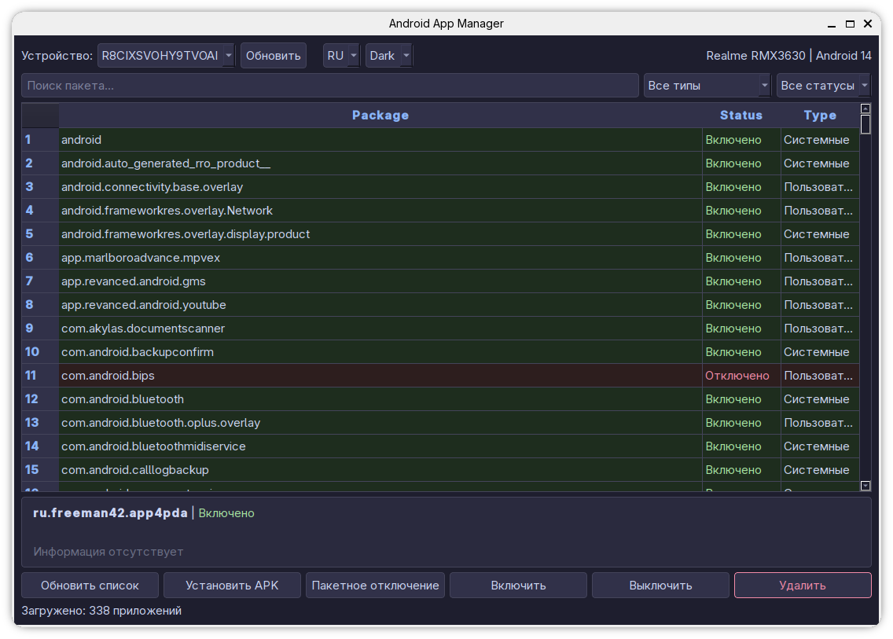

# Android App Manager

GUI приложение для управления Android приложениями через ADB.

## Запуск приложения

🇷🇺 Форк проекта [mehran-mousavi/Adb-AppManager-GUI](https://github.com/mehran-mousavi/Adb-AppManager-GUI)

## Возможности

- 📱 Просмотр всех установленных приложений
- 🔍 Поиск и фильтрация приложений
- ⚡ Включение/отключение приложений
- 🗑️ Удаление приложений (включая системные)
- 📦 Установка APK-файлов
- 📦 Экспорт APK-файлов с подключенного устройства
- 📋 Пакетное отключение приложений
- 🌓 Тёмная/светлая тема
- 🌍 Поддержка русского и английского языков
- 📊 Интеграция с Universal Android Debloater списками

## Установка

### Зависимости
- Python 3.8+
- ADB (Android Debug Bridge)
- PyQt5

### Из исходников
```bash
python main.py
```


Android App Manager is a Python-based GUI application that allows users to manage their Android applications via ADB (Android Debug Bridge).

## Features

- 📱 View all installed apps
- 🔍 Search and filter apps
- ⚡ Enable/disable apps
- 🗑️ Remove apps (including system apps)
- 📦 Install APK files
- 📦 Export APK files from a connected device
- 📋 Batch disable apps
- 🌓 Dark/light theme
- 🌍 Support for Russian and English
- 📊 Integration with Universal Android Debloater lists

### Способ 2: Через скрипт run.sh
```bash
./run.sh
```

## Requirements

- Python 3.8+
- ADB (Android Debug Bridge)
- PyQt5

## Usage

## Установка зависимостей

The application will start and display a GUI to manage your Android applications.

## Note

- `src/android_manager/` - основной код приложения (модульная версия)
  - `main.py` - точка входа
  - `ui/` - интерфейс пользователя
  - `core/` - ядро (ADB контроллер)
  - `utils/` - утилиты, константы, локализация
  - `data/` - загрузчики данных
- `scripts/` - скрипты сборки (DEB, RPM)
- `tests/` - тесты

## Возможности

- Просмотр списка установленных приложений
- Включение/отключение приложений
- Удаление приложений
- Экспорт APK файлов с устройства
- Установка APK файлов
- Пакетное отключение приложений
- Фильтрация по типу и статусу
- Поиск по имени пакета
- Поддержка русского и английского языков
- Тёмная и светлая темы

## Сборка пакетов

```bash
# Сборка DEB
./scripts/build_deb.sh

# Сборка RPM
./scripts/build_rpm.sh

# Сборка всех пакетов
./scripts/build_all.sh
```
